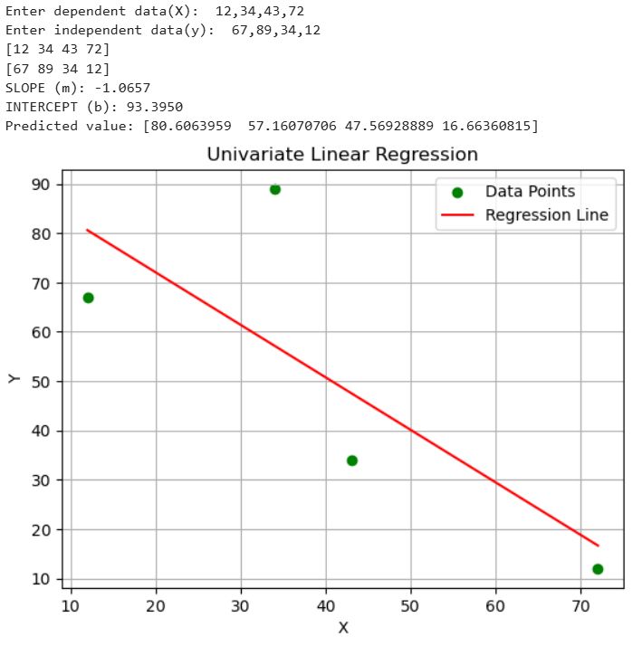

# Implementation of Univariate Linear Regression
## AIM:
To implement univariate Linear Regression to fit a straight line using least squares.

## Equipments Required:
1. Hardware – PCs
2. Anaconda – Python 3.7 Installation / Jupyter notebook

## Algorithm
1. Get the independent variable X and dependent variable Y.
2. Calculate the mean of the X -values and the mean of the Y -values.
3. Find the slope m of the line of best fit using the formula. 

4. Compute the y -intercept of the line by using the formula:

5. Use the slope m and the y -intercept to form the equation of the line.
6. Obtain the straight line equation Y=mX+b and plot the scatterplot.

## Program:

Program to implement univariate Linear Regression to fit a straight line using least squares.
## Developed by: HEMALISHA T
## RegisterNumber: 212225040123

```
import numpy as np
import matplotlib.pyplot as plt


arr=eval(input("Enter dependent data(X): "))
arr1=eval(input("Enter independent data(y): "))

x = np.array(arr)
y = np.array(arr1)
print(x)
print(y)
n=len(x)

m=(n*np.sum(x*y)-np.sum(x)*np.sum(y))/(n*np.sum(x**2)-((np.sum(x))**2))
b=(np.sum(y)-m*np.sum(x))/n

print(f"SLOPE (m): {m:.4f}")
print(f"INTERCEPT (b): {b:.4f}")

y_pred = m*x + b
print(y_pred)

plt.scatter(x,y, color='g', label="Data Points")
plt.plot(x, y_pred, color='r' ,label='Regression Line')
plt.title("Univariate Linear Regression")
plt.xlabel('X')
plt.ylabel('Y')
plt.legend()
plt.grid("True")
plt.show()
```

## Output:



## Result:
Thus the univariate Linear Regression was implemented to fit a straight line using least squares using python programming.
